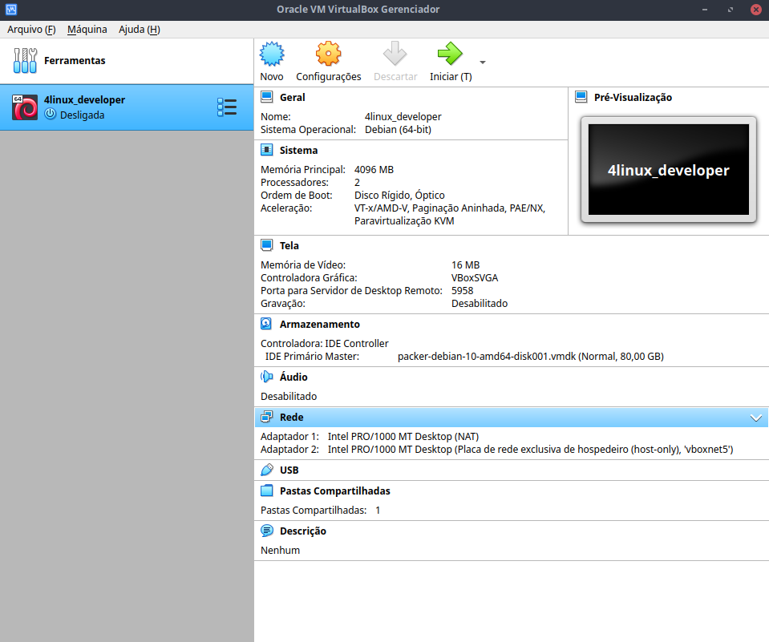
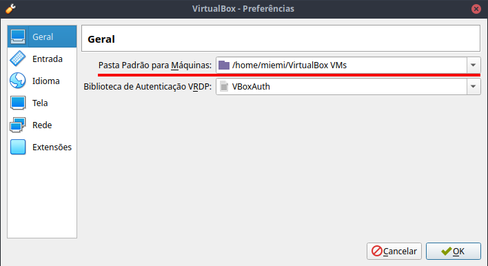

# Infraestrutura 

## Requisitos Computacionais

Os requisitos necessários para um bom acompanhamento de curso são mínimos, a maioria dos computadores/notebooks atuais oferecerão com sobra:

* 4GB de RAM disponíveis
* 1GB aproximadamente de espaço em disco
* Processador core 2 duo ou superior


## Dependências

Os requisitos mínimos de instalação são:

* Python 3.6+
* PIP 3

Desejáveis:

* Um editor de texto da sua preferência (Vim, VSCode, Atom, Sublime, etc.)
* MongoDB
* MySQL Server


Independente do sistema operacional utilizado, caso conseguir providenciar a instalação dos softwares listados acima, você está pronto para acompanhar o curso.

Caso você não esteja confiante em preparar essas instalações ou preferir não modificar o seu sistema atual, há uma opção de utilizar máquinas virtuais para garantir o isolamento e já ter tudo pronto e configurado para o curso.


## Máquinas virtuais

Há duas formas de provisionar as máquinas virtuais. Ambas dependem da instalação do [VirtualBox](https://www.virtualbox.org). 

Instale a última versão do Virtualbox para o seu sistema operacional através do endereço [https://www.virtualbox.org/wiki/Downloads](https://www.virtualbox.org/wiki/Downloads).  


### Provisionamento com Vagrant

O [Vagrant](https://vagrantup.com) é uma ferramenta de automação dedicada ao gerenciamento de máquinas virtuais para fins de testes. Com ele é possível automatizar instalação de máquinas virtuais em _hypervisors_ como o Virtualbox. 

Para se valer desse benefício, instale a última versão do Vagrant em seu sistema operacional no seguinte endereço [https://www.vagrantup.com/downloads](https://www.vagrantup.com/downloads).

Depois de realizada a instalação, realize o download deste [repositório](https://github.com/4linux/4520/archive/main.zip) e descompacte o arquivo **.zip** em uma pasta qualquer. 

Feito este passo, basta entrar no diretório `infraestrutura` através de um prompt de comando e digitar os seguintes comandos:

```
main > cd infraestrutura
main > vagrant up
```

Aperte enter e espere o Vagrant configurar tudo. Pode levar alguns minutos, e muitas mensagens aparecerão na tela. Não se preocupe, é normal :).

Depois que terminar o provisionamento, abra o seu VirtualBox. Você verá que terá uma máquina pronta para uso:



Basta clicar duas vezes e inicializar a sua máquina virtual.


#### Usuários Windows

Caso aconteça algum problema no passo anterior verifique se:

1. O Virtualbox está instalado
  
	Verifique o passo anterior e realize a instalação do Virtualbox

1. O repositório está em um diretório ou caminho que contém caracteres especiais
  
	O Windows aceita a criação de diretório com caracteres especiais tais como espaços e acentos. Isso pode ser um problema. Recomendamos que utilize um diretório na raiz de uma partição (`C:\main\`, por exemplo). 
  
1. O caminho padrão dos arquivos do Virtualbox contém caracteres especiais
	A mesma recomendação para o diretório do Windows vale para o Virtualbox - caso o diretório do seu usuário possuir caracteres especiais, é necessário alterar o diretório padrão do Virtualbox.
	
	Para isso, crie um diretório na raiz de uma partição (`C:\VirtualBox\` por exemplo) e indique esse caminho no Virtualbox em Aquivo > Preferências:

  	
  
1. HyperV esteja desativado
  
	O hypervisor da Microsoft pode apresentar conflitos com o Virtualbox.

  	Para desativar o HyperV, utilize o seguinte comando em prompt de comando com permissões de administrador:

	``` shell
	dism.exe /Online /Disable-Feature:Microsoft-Hyper-V
	```

	Será preciso que você reinicie o computador.

	Depois se você quiser habilitar novamente o HyperV utilize o seguinte comando (também com permissões de administrador):

	``` shell
	dism.exe /Online /Enable-Feature:Microsoft-Hyper-V /All	
	```

	Se ainda tiver problemas verifique se a pasta a qual você colocou o diretório do repositório não contém acentuação e/ou espaços. 


## OVAs 

Na plataforma do curso há um link para download da máquina virtual no formato  **.OVA** que pode ser importado diretamente no VirtualBox . Por se tratar de um arquivo que contém um sistema operacional completo já configurado, ele ele é pesado, com tamanho próximo de 1GB. 


